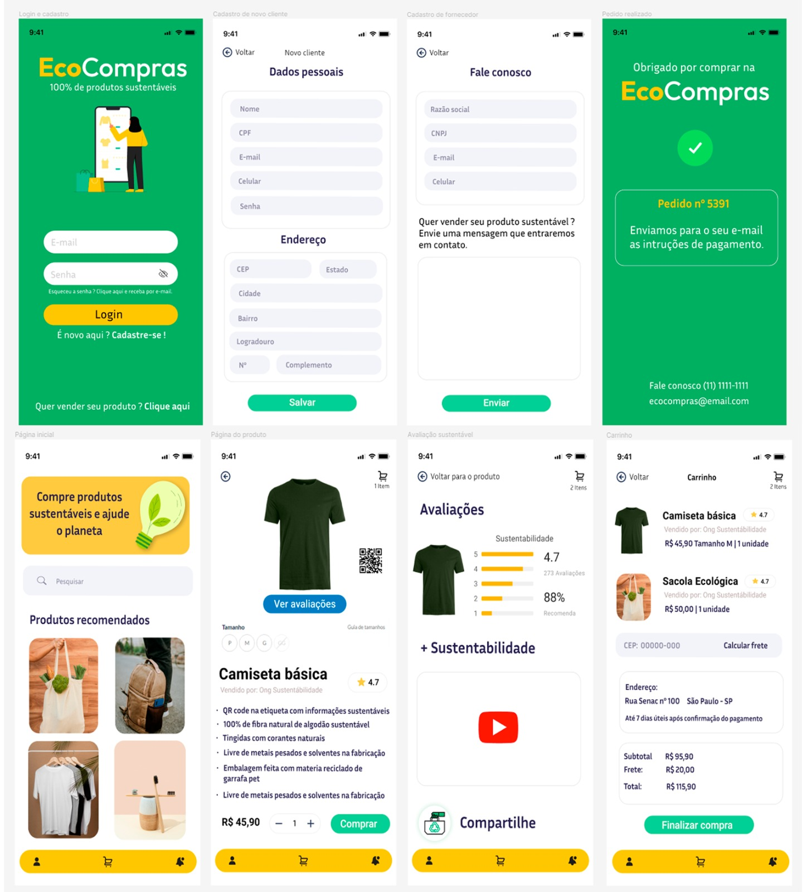

<h1 align="center">

<p>100% de produtos sustentáveis</p>
</h1>

# Sobre o projeto 🔎

O aplicativo "EcoCompras" tem como objetivo ajudar os consumidores a fazerem escolhas mais sustentáveis ao fazer compras. Ele fornece informações detalhadas sobre o impacto ambiental de produtos, permitindo que os usuários façam escolhas conscientes em relação aos produtos que compram. O aplicativo também se esforça para educar os usuários sobre questões ambientais e promover práticas de compra ecologicamente corretas.

## Layout Mobile


## Pré-requisitos para rodar o projeto

Tudo que precisa para rodar o projeto:

* Item 1
* Item 2
* Item 3


## Como utilizar o site/app

Pendente adicionar conteúdo...

```
$ Primeiro exemplo
$ Segundo exemplo
$ Terceiro exemplo
````

## Implementação

```bash
# CLona o projeto p/ sua máquina
 $ git clone https://github.com/ZoG101/EcoCompras.git
 ````

 ```bash
 # Acessar o diretório
 $ cd EcoCompras
 ````

 ```bash
 # Acessar o código (Necessário VisualCode)
 $ code .
 ````
 <h3 align="center">
 <p>Após alterações, seguir passo a passo para fazer o commit da sua branch</p>
 </h3>

```bash
 # Atualiza a versão mais recente da master
 $ git pull
 ````

 ```bash
 # Cria a branch para subir o código
 $ git checkout -b nome-da-branch
 ````

 ```bash
 # Verifica quais alterações foram feitas
 $ git status
 ````

 ```bash
 # Adiciona as alterações
 $ git add .
 ````

 ```bash
 # Comita as alterações feitas
 $ git commit -m "(mensagem explicando as alterações)"
 ````

 ```bash
 # Subir as alterações no repositório
 $ git push --set-upstream origin nome-da-branch
 ````

## Tecnologias utilizadas

[](https://skillicons.dev)

## Branches

* Master:
* Feature:
* Bugfix:

## Responsáveis pelo projeto 👨‍🎓

* Fernanda Capannacci Cuofano
* Felipe Aparecido Flosi
* Wendell Franck Nascimento Lavor
* Pedro Henrique Vanni De Aquino
* Aquino Davi Campolina Leite Morato
* Júlio Cesar Marques
