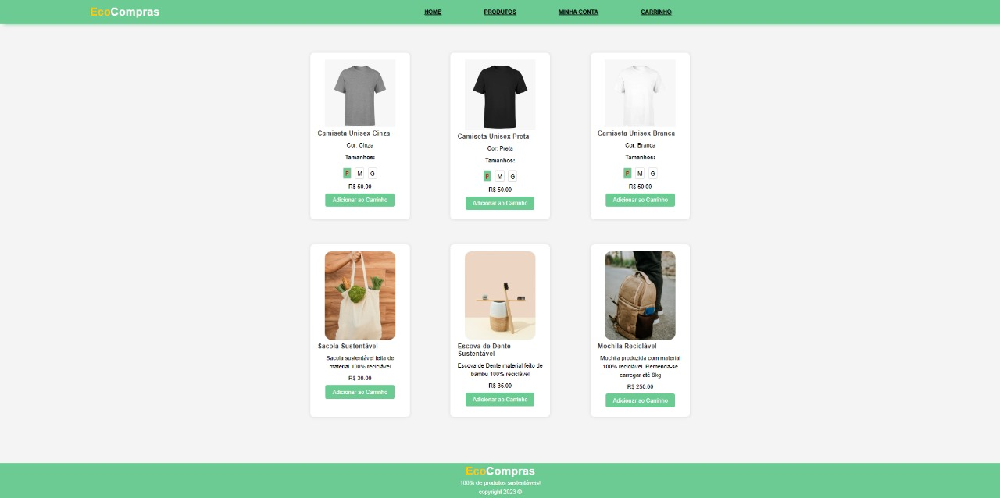
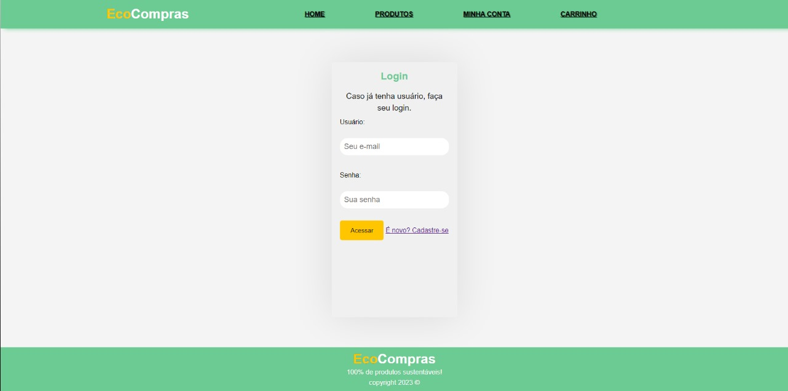
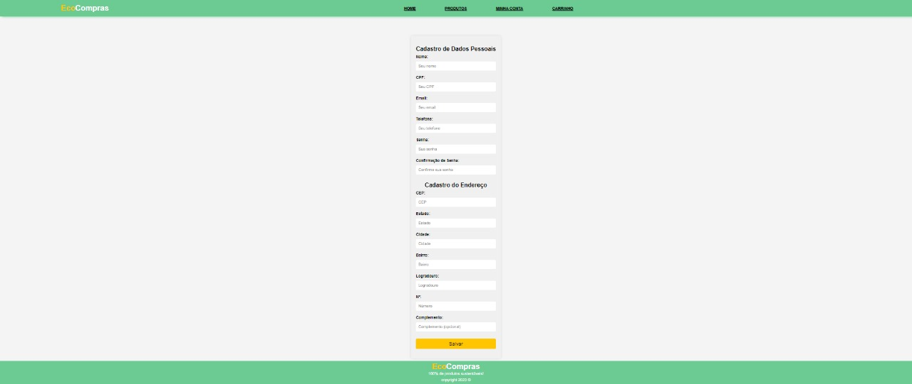
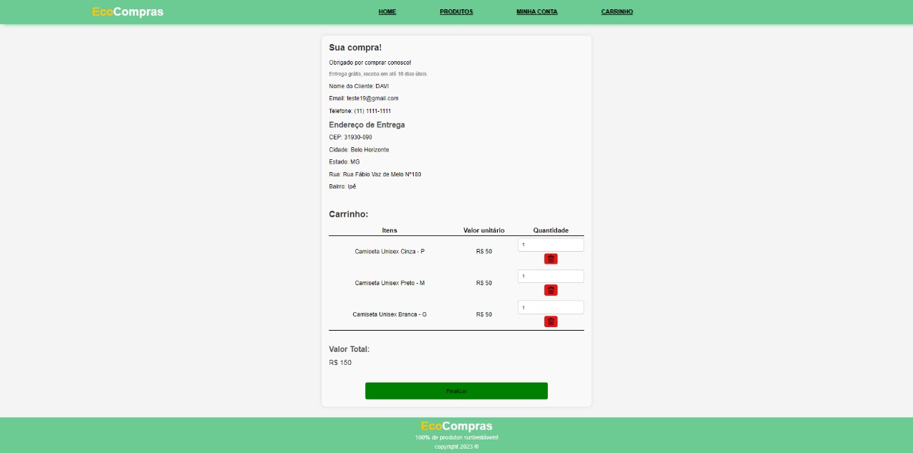

<h1 align="center">

<p>100% de produtos sustentáveis</p>
</h1>

# Sobre o projeto 🔎

O aplicativo "EcoCompras" tem como objetivo ajudar os consumidores a fazerem escolhas mais sustentáveis ao fazer compras. Ele fornece informações detalhadas sobre o impacto ambiental de produtos, permitindo que os usuários façam escolhas conscientes em relação aos produtos que compram. O aplicativo também se esforça para educar os usuários sobre questões ambientais e promover práticas de compra ecologicamente corretas.

## Layout Mobile 📱


## Layout Remodelagem Desktop 


[Figma](https://www.figma.com/file/j4h9INukqhoj0DfG7nSrHd/PTI---Remodelagem?type=design&mode=design)


## Pré-requisitos para rodar o projeto 


* <h3>SGBD Relacional (MySQL):</h3>
A aplicação requer um Sistema de Gerenciamento de Banco de Dados (SGBD) relacional, com preferência para o MySQL. Certifique-se de que o MySQL esteja configurado e acessível para a aplicação.
* <h3>Servidor com Suporte a PHP (Apache):</h3>
É necessário um servidor que ofereça suporte a aplicações PHP, com preferência para o Apache. Certifique-se de que o servidor esteja configurado para interpretar e executar scripts PHP corretamente.
* <h3>Recriação do Banco de Dados:</h3>
Os comandos necessários para recriar o banco de dados estão disponíveis na pasta "dump" deste repositório. Certifique-se de seguir esses comandos para configurar corretamente o banco de dados antes de iniciar a aplicação.
* <h3>Configuração do Servidor:</h3>
Recomendamos o uso do servidor contido na pasta "server". Para configurá-lo, basta descompactar o conteúdo e colocar os arquivos do projeto dentro da pasta "www". Inicie o servidor Apache utilizando o UniControllerZ.
* <h3>Configuração da Conexão com o MySQL:</h3>
É crucial configurar a conexão com o servidor local do MySQL para garantir o funcionamento adequado da aplicação. A configuração da conexão está no arquivo localizado em "classes > domain > ConnectionFactory.php". Abra este arquivo e ajuste as configurações de conexão conforme necessário para refletir as configurações do seu ambiente local.

Certifique-se de seguir essas etapas cuidadosamente para garantir uma configuração adequada do ambiente e um funcionamento correto da aplicação. Para mais detalhes ou problemas, consulte a documentação completa fornecida neste repositório.
* <h3>Código-Fonte:</h3>
O código-fonte da aplicação está disponível no repositório


## Como utilizar o site/app

* <h3> Acesse o menu inicial da loja; 


* <h3> Navegue pelo catálogo de produtos;


* <h3> Realize o seu login; 


* <h3> Caso nao tenha um login, realize o seu cadastro;



* <h3> Acesse o carrinho para finalizar a compra;


* <h3> Acesse a página do cliente para acompanhar o seu pedido;


## Implementação
 
<h3 align="center">
 <p>Como contribuir com o projeto</p>
 </h3>

```bash
# CLona o projeto p/ sua máquina
$ git clone https://github.com/ZoG101/EcoCompras.git
 ````

 ```bash
 # Acessar o diretório
 $ cd EcoCompras
 ````

 ```bash
 # Acessar o código (Necessário VisualCode)
 $ code .
 ````
 <h3 align="center">
 <p>Após alterações, seguir passo a passo para fazer o commit da sua branch</p>
 </h3>

```bash
 # Atualiza a versão mais recente da master
$ git pull
 ````

 ```bash
 # Cria a branch para subir o código
 $ git checkout -b nome-da-branch
 ````

 ```bash
 # Verifica quais alterações foram feitas
 $ git status
 ````

 ```bash
 # Adiciona as alterações
 $ git add .
 ````

 ```bash
 # Comita as alterações feitas
 $ git commit -m "(mensagem explicando as alterações)"
 ````

 ```bash
 # Subir as alterações no repositório
 $ git push --set-upstream origin nome-da-branch
 ````

## Tecnologias utilizadas

[](https://skillicons.dev)

## Branches

* Master:
* Feature:
* Bugfix:

## Responsáveis pelo projeto 👨‍🎓

* Fernanda Capannacci Cuofano
* Felipe Aparecido Flosi
* Wendell Franck Nascimento Lavor
* Pedro Henrique Vanni De Aquino
* Davi Campolina Leite Morato
* Júlio Cesar Marques
